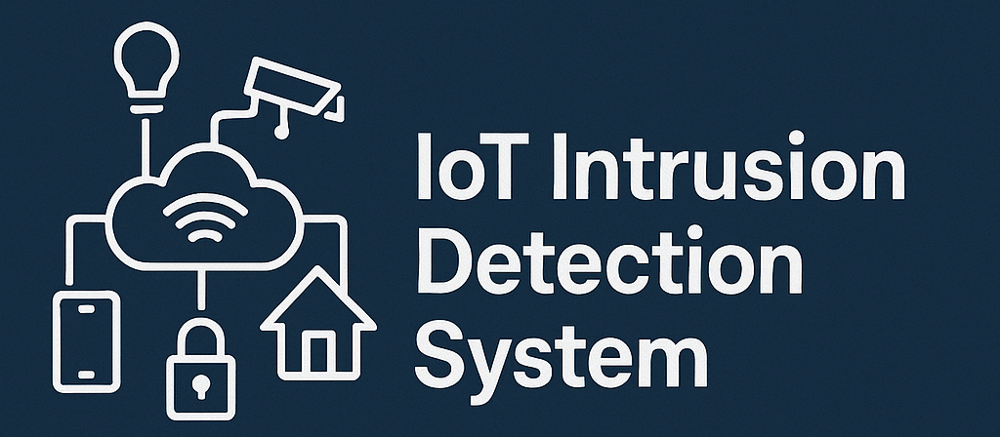
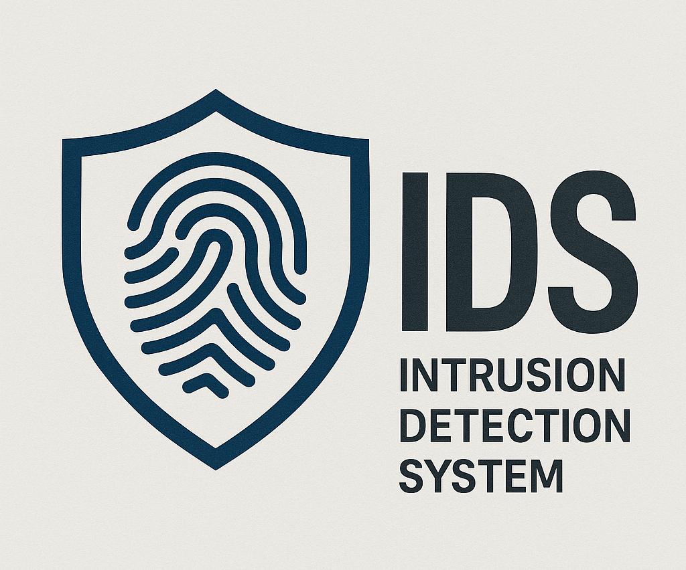

<p align="center">
  
</p>

<h1 align="center">🔐 IoT Intrusion Detection System (IDS)</h1>

<p align="center">
  
</p>

<p align="center">
  <b>Raspberry Pi–based Intrusion Detection System for IoT Networks</b>  
  <br/>A collaborative project by 4 team members  
</p>

---

<p align="center">
  <!-- Shields.io badges -->
  
  
  
  
  
</p>

---

## 🚀 Overview
This project implements a **backend + IDS integration** for monitoring IoT traffic using Raspberry Pi.  
The system uses **Suricata IDS** to detect suspicious traffic and forwards alerts to a **Flask + SQLite backend**, which powers a web dashboard.

---

## 🗂 Project Structure
```
IDS/
│
├── backend/
│   ├── app.py
│   ├── database.py
│   ├── requirements.txt
│   ├── alerts.db
│   └── __init__.py              # (optional, for package)
│
├── suricata-pi/                 # IDS side (Pi par run hoga)
│   ├── forwarder.py             # Script: eve.json → Flask ingest API
│   └── local.rules              # Custom Suricata rules
│
├── frontend/
│   ├── index.html
│   ├── static/
│   └── script.js            # Fetch alerts from API
│
├── docs/
│   ├── Report.docx
│   ├── Report.pdf
│   └── Screenshots/
│       ├── alert_ping.png
│       └── nmap_detected.png
│
├── demo-attacks/                # Kali Linux side scripts (testing only)
│   ├── nmap_scan.sh
│   ├── brute_force.py
│   └── arp_spoof.sh
│
└── README.md
```

---

## ⚙️ Setup (Backend)

### 1️⃣ Clone Repository
```bash
git clone https://github.com/Drag0nSlay/Intrusion-Detection-System.git
cd Intrusion-Detection-System/backend
```

### 2️⃣ Install Dependencies
```bash
pip install -r requirements.txt
```

3️⃣ Run Backend
```bash
python app.py
```
Backend runs at → http://localhost:5000

---

## 🖥 API Endpoints
| Endpoint  | Method | Description            |
| --------- | ------ | ---------------------- |
| `/ingest` | POST   | Ingest Suricata alerts |
| `/alerts` | GET    | Fetch last 20 alerts   |

**Post Example (Expected)**
```bash
{
  "timestamp": "2025-09-29T23:45:00",
  "src_ip": "192.168.0.10",
  "dest_ip": "192.168.0.1",
  "proto": "ICMP",
  "alert": {
    "signature": "ICMP PING detected",
    "severity": 2
  }
}
```
---

## 📊 Demo Output
<p align="center">  </p>

## 🛠 Tech Stack
- Python 3.12
- Flask 2.3.3
- SQLite
- Suricata IDS
- Raspberry Pi 3 or 4

## 👥 Team Roles

- Backend Developer & Testing (Me 😉) → Flask + SQLite APIs, attack simulation
- Infra & IDS Lead → Raspberry Pi setup, Suricata setup on Pi
- Frontend Developer → Dashboard (consume /alerts)

## 📌 Roadmap

- ✅ Backend setup (Flask + SQLite)
- ✅ Alert ingestion pipeline
- [ ] Frontend dashboard UI
- [ ] Raspberry Pi integration with Suricata
<!-- [] Advanced ML-based detection -->

This project is licensed under the [MIT License](https://github.com/Drag0nSlay/Intrusion-Detection-System?tab=MIT-1-ov-file).
<p align="center">💡 Built with teamwork, cybersecurity passion, and lots of ☕</p> ```
