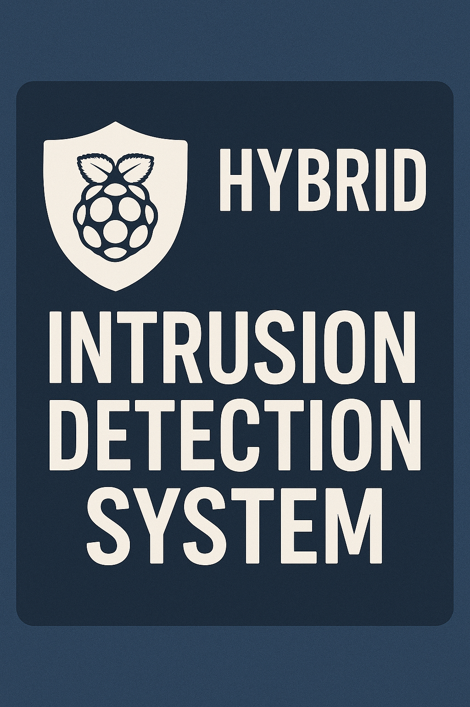

<p align="center">
  
</p>

<h1 align="center">🛡️ Hybrid Intrusion Detection System (H-IDS)</h1>

<p align="center">
  
</p>

<p align="center">
  <b>Raspberry Pi–based Hybrid Intrusion Detection System for IoT & Network Environments</b>  
  <br/>A collaborative project by 4 team members  
</p>

---

<p align="center">
  <!-- Shields.io badges -->
  
  
  
  
  
  <a href="https://github.com/Drag0nSlay/Intrusion-Detection-System/actions/workflows/pylint.yml">
  
</a>
  

</p>

---
## 📑 Table of Contents
- [Overview](#-overview)
- [Project Structure](#-project-structure)
- [Documentation](#-documentation)
- [Setup](#%EF%B8%8F-setup-backend)
- [API Endpoints](#-api-endpoints)
- [Demo Output](#-demo-output)
- [Tech Stack](#-tech-stack)
- [Team Roles](#-team-roles)
- [Roadmap](#-roadmap)
- [License](https://github.com/Drag0nSlay/Intrusion-Detection-System?tab=MIT-1-ov-file)
---

## 🚀 Overview
This project implements a **Hybrid Intrusion Detection System (H-IDS)** that combines **IoT-based hardware detection (Raspberry Pi)** and **software-based network monitoring (Flask + SQLite backend)**.

The Raspberry Pi runs **Suricata IDS**, acting as a **lightweight IoT security node** that monitors local network traffic and detects potential intrusions in real time.  
Detected alerts are securely forwarded to a **central backend server**, where logs are stored, analyzed, and visualized on a dashboard.

> ⚡ In short: **The Pi acts as a smart IoT-IDS node**, while the Flask backend forms the **central Network-IDS server** — together forming a **Hybrid IDS ecosystem**.
---

## 🗂 Project Structure
```
IDS/
│
├── backend/
│   ├── app.py                  # Flask/FastAPI alert ingestion + APIs
│   ├── database.py             # SQLite / PostgreSQL handler
│   ├── alerts.db
│   ├── requirements.txt
│   └── __init__.py
│
├── ids-engine/
│   ├── suricata.yaml           # Suricata config (software mode)
│   ├── local.rules             # Custom detection rules
│   ├── eve_forwarder.py        # Reads eve.json & sends to backend
│   └── eve.json                # Generated alerts (runtime)
│
├── frontend/                   # Optional but GOOD for marks
│   ├── index.html
│   ├── static/
│   └── script.js
│
├── attack-simulation/          # Testing environment
│   ├── nmap_scan.sh
│   ├── brute_force.py
│   └── arp_spoof.sh
│
├── docs/
│   ├── Report.docx
│   ├── Report.pdf
│   └── Screenshots/
│       ├── nmap_detected.png
│       ├── brute_force_alert.png
│
└── README.md
```
---

## 📖 Documentation
- 📐 [System Architecture](docs/architecture.md)
- 📑 [User Manual](docs/user_manual.md)

---


## ⚙️ Setup (Backend)

### 1️⃣ Clone Repository
```bash
git clone https://github.com/Drag0nSlay/Intrusion-Detection-System.git
cd Intrusion-Detection-System/Backend
```

### 2️⃣ Install Dependencies
```bash
pip install -r requirements.txt
```

3️⃣ Run Backend
```bash
python app.py
```
Backend runs at → http://localhost:5000

---

## 🖥 API Endpoints
| Endpoint  | Method | Description            |
| --------- | ------ | ---------------------- |
| `/ingest` | POST   | Ingest Suricata alerts |
| `/alerts` | GET    | Fetch last 20 alerts   |

**Post Example (Expected)**
```bash
{
  "timestamp": "2025-09-29T23:45:00",
  "src_ip": "192.168.0.10",
  "dest_ip": "192.168.0.1",
  "proto": "ICMP",
  "alert": {
    "signature": "ICMP PING detected",
    "severity": 2
  }
}
```
---

## 📊 Demo Output
<p align="center">  </p>

## 🛠 Tech Stack
- Python 3.12
- Flask 2.3.3
- SQLite
- Suricata IDS
- Raspberry Pi 3 or 4
- Requests (for alert forwarding)

## 👥 Team Roles

- Backend Developer & Testing (Me 😉) → Flask + SQLite APIs, alert integration and attack simulation
- Infra & IDS Lead → Raspberry Pi setup, Suricata setup on Pi and hardware deployment
- Frontend Developer → Dashboard for real-time alert visualization
- Documentation & Testing Support → Reports, screenshots, and verification

## 📌 Roadmap

<h3> ✅ Current Phase — Network IDS + IoT Integration </h3>

- ✅ Backend setup (Flask + SQLite)
- ✅ Alert ingestion pipeline
- [ ] Frontend dashboard UI
- [ ] Raspberry Pi integration with Suricata
<!-- [] Advanced ML-based detection -->
- [ ] Forwarding via REST API

## 🔄 Upcoming — Hybrid IDS Phase

- Multiple Raspberry Pi nodes acting as distributed IoT sensors
- Central dashboard with Pi-node health & alert analytics
- Secure communication (MQTT-based transmission)

This project is licensed under the [MIT License](https://github.com/Drag0nSlay/Intrusion-Detection-System?tab=MIT-1-ov-file).
<p align="center">💡 Built with teamwork, cybersecurity passion, and lots of ☕</p> ```
